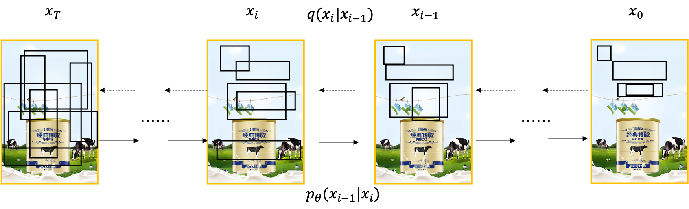

## Relation-Aware Diffusion Model for Controllable Poster Layout Generation (CIKM 2023)

## Get Start
### 1. Data Preparation
#### Training Data
Download the CGL-dataset from the [official website](https://tianchi.aliyun.com/dataset/142692).
To get clean images, use [LaMa](https://github.com/advimman/lama#inference-) to erase the texts from train images. Put clean images in DatasetRoot/images/train
#### Testing Data
Download the testing data and text features from the [url](https://3.cn/10-dQKDKG) and unzip to DatasetRoot.
The final DatasetRoot structure should be the following.
```text
DatasetRoot
├── annotations
│   ├── train.json
│   ├── test.json
├── images
│   ├── train
│   ├── test
├── text_content
│   ├── train.txt
│   ├── test.txt
├── text_features
│   ├── train
│   ├── test
```
### 2. Installation
The source code is based on [DiffusionDet](https://github.com/ShoufaChen/DiffusionDet) and [Detectron2](https://github.com/facebookresearch/detectron2).
#### (1). Install [Detectron2](https://github.com/facebookresearch/detectron2/blob/main/INSTALL.md#installation)
#### (2). Install RADM requirements
pytorch=1.8.0 python=3.7 cuda=11.1

```
pip install -r requirements.txt
```
### Train and inference
Before training, you need to modify the DATASET_PATH, OUTPUT_DIR and TEXT_FEATURE_PATH in configs/radm.yaml
#### train
```shell
python3 train_net.py --num-gpus 1 \
    --config-file configs/radm.yaml \
```
Train with multiple GPUs from checkpoints.
```shell
python3 train_net.py --num-gpus 4 \
    --config-file configs/radm.yaml \ 
    --resume
```
#### inference
```shell
python train_net.py --num-gpus 1 \
    --config-file configs/radm.yaml \
    --eval-only --resume
```
To evaluate the layout result, you need modify the test_imgdir, test_annotation and test_label in metrics.py first. The functions to compute $R_{shm}$ and $R_{sub}$ are not provided because they need some internal APIs.  
```shell
python metrics.py
```


## Citation
```BibTeX
@inproceedings{fengheng2023relation,
    author = {Li, Fengheng and Liu, An and Feng, Wei and Zhu, Honghe and Li, Yaoyu and Zhang, Zheng and Lv, 
    Jingjing and Zhu, Xin and Shen, Junjie and Lin, Zhangang and Shao, Jingping},
    title = {Relation-Aware Diffusion Model for Controllable Poster Layout Generation},
    year = {2023},
    booktitle = {Proceedings of the 32nd ACM International Conference on Information and Knowledge Management},
    pages = {1249–1258},
}
```